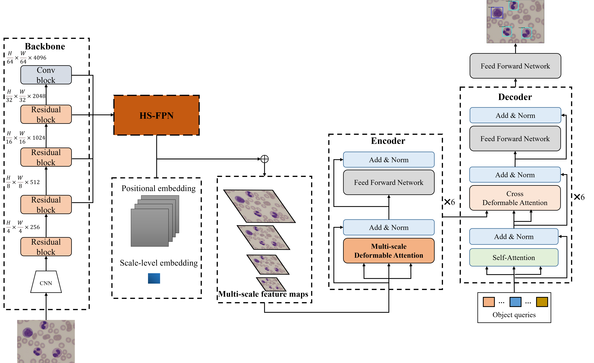
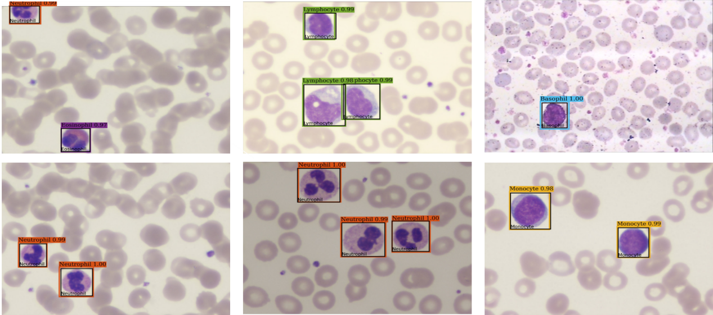

# MFDS-DETR

The overall architecture of MFDS-DETR comprises four parts: Backbone, High-level Screening-feature Pyramid Networks, Encoder and Decoder.


Prediction results of MFDS-DETR on the WBCDD dataset (black boxes indicate Ground Truth and different colored boxes indicate its prediction boxes).


## 1. Installation

### (1) Requirements

* Linux, CUDA>=9.2, GCC>=5.4
  
* Python>=3.7

    We recommend you to use Anaconda to create a conda environment:
    ```bash
    conda create -n deformable_detr python=3.7 pip
    ```
    Then, activate the environment:
    ```bash
    conda activate deformable_detr
    ```
  
* PyTorch>=1.5.1, torchvision>=0.6.1 (following instructions [here](https://pytorch.org/))

    For example, if your CUDA version is 9.2, you could install pytorch and torchvision as following:
    ```bash
    conda install pytorch=1.5.1 torchvision=0.6.1 cudatoolkit=9.2 -c pytorch
    ```
  
* Other requirements
    ```bash
    pip install -r requirements.txt
    ```

### (2) Compiling CUDA operators
```bash
cd ./models/ops
sh ./make.sh
# unit test (should see all checking is True)
python test.py
```

## 2. Usage

### (1) Dataset preparation

For convenience we referenced the code of [Deformable DETR](https://github.com/fundamentalvision/Deformable-DETR), so please rename the dataset you are using as following:

```
code_root/
└── data/
    └── coco/
        ├── train2017/
        ├── val2017/
        └── annotations/
        	├── instances_train2017.json
        	└── instances_val2017.json
```

### (2) Training

#### Training on single node

For example, the command for training Deformable DETR on 8 GPUs is as following:

```bash
GPUS_PER_NODE=8 ./tools/run_dist_launch.sh 8 ./configs/r50_deformable_detr.sh
```

#### Training on multiple nodes

For example, the command for training Deformable DETR on 2 nodes of each with 8 GPUs is as following:

On node 1:

```bash
MASTER_ADDR=<IP address of node 1> NODE_RANK=0 GPUS_PER_NODE=8 ./tools/run_dist_launch.sh 16 ./configs/r50_deformable_detr.sh
```

On node 2:

```bash
MASTER_ADDR=<IP address of node 1> NODE_RANK=1 GPUS_PER_NODE=8 ./tools/run_dist_launch.sh 16 ./configs/r50_deformable_detr.sh
```

#### Training on slurm cluster

If you are using slurm cluster, you can simply run the following command to train on 1 node with 8 GPUs:

```bash
GPUS_PER_NODE=8 ./tools/run_dist_slurm.sh <partition> deformable_detr 8 configs/r50_deformable_detr.sh
```

Or 2 nodes of  each with 8 GPUs:

```bash
GPUS_PER_NODE=8 ./tools/run_dist_slurm.sh <partition> deformable_detr 16 configs/r50_deformable_detr.sh
```
#### Some tips to speed-up training
* If your file system is slow to read images, you may consider enabling '--cache_mode' option to load whole dataset into memory at the beginning of training.
* You may increase the batch size to maximize the GPU utilization, according to GPU memory of yours, e.g., set '--batch_size 3' or '--batch_size 4'.

### (3) Evaluation

You can get the config file and run following command to evaluate it on your dataset:

```bash
<path to config file> --resume <path to pre-trained model> --eval
```

You can also run distributed evaluation by using ```./tools/run_dist_launch.sh``` or ```./tools/run_dist_slurm.sh```.


## 3. Convenience for windows

For the convenience of windows users, we provide two files, ```mine.py``` and ```predict.py```, you can run these two files for training and prediction.

## 4. WBCCD dataset and LISC dataset
Under the guidance of our team's associated medical practitioners, we labeled the existing publicly available leukocyte classification dataset, LISC, with target frames. 
We also collaborated with our partner hospitals to develop our own leukocyte detection dataset, WBCCD.

If you want to use our private and relabelled datasets, please cite our article.

Donwload link of labeled WBCCD dataset is available at [https://drive.google.com/file/d/11eBT-JXXjkhEshuQ5WxtSwKY6soIsJra/view?usp=drive_link](https://drive.google.com/file/d/11eBT-JXXjkhEshuQ5WxtSwKY6soIsJra/view?usp=drive_link).

Donwload link of labeled LISC dataset is available at [https://drive.google.com/file/d/1GNvPqiIs1MpCU_LK14gWo5FqyaCceKzj/view?usp=drive_link](https://drive.google.com/file/d/1GNvPqiIs1MpCU_LK14gWo5FqyaCceKzj/view?usp=drive_link).


## 5. Citation
```
@article{CHEN2024107917,
title = {Accurate leukocyte detection based on deformable-DETR and multi-level feature fusion for aiding diagnosis of blood diseases},
journal = {Computers in Biology and Medicine},
volume = {170},
pages = {107917},
year = {2024},
issn = {0010-4825},
doi = {https://doi.org/10.1016/j.compbiomed.2024.107917},
url = {https://www.sciencedirect.com/science/article/pii/S0010482524000015},
author = {Yifei Chen and Chenyan Zhang and Ben Chen and Yiyu Huang and Yifei Sun and Changmiao Wang and Xianjun Fu and Yuxing Dai and Feiwei Qin and Yong Peng and Yu Gao},
keywords = {Leukocyte, Object detection, Deformable self-attention DETR, Multi-level feature fusion, High-level screening-feature pyramid},
abstract = {In standard hospital blood tests, the traditional process requires doctors to manually isolate leukocytes from microscopic images of patients’ blood using microscopes. These isolated leukocytes are then categorized via automatic leukocyte classifiers to determine the proportion and volume of different types of leukocytes present in the blood samples, aiding disease diagnosis. This methodology is not only time-consuming and labor-intensive, but it also has a high propensity for errors due to factors such as image quality and environmental conditions, which could potentially lead to incorrect subsequent classifications and misdiagnosis. Contemporary leukocyte detection methods exhibit limitations in dealing with images with fewer leukocyte features and the disparity in scale among different leukocytes, leading to unsatisfactory results in most instances. To address these issues, this paper proposes an innovative method of leukocyte detection: the Multi-level Feature Fusion and Deformable Self-attention DETR (MFDS-DETR). To tackle the issue of leukocyte scale disparity, we designed the High-level Screening-feature Fusion Pyramid (HS-FPN), enabling multi-level fusion. This model uses high-level features as weights to filter low-level feature information via a channel attention module and then merges the screened information with the high-level features, thus enhancing the model’s feature expression capability. Further, we address the issue of leukocyte feature scarcity by incorporating a multi-scale deformable self-attention module in the encoder and using the self-attention and cross-deformable attention mechanisms in the decoder, which aids in the extraction of the global features of the leukocyte feature maps. The effectiveness, superiority, and generalizability of the proposed MFDS-DETR method are confirmed through comparisons with other cutting-edge leukocyte detection models using the private WBCDD, public LISC and BCCD datasets. Our source code and private WBCCD dataset are available at https://github.com/JustlfC03/MFDS-DETR.}
}
```
